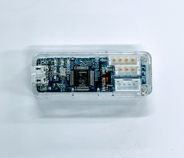
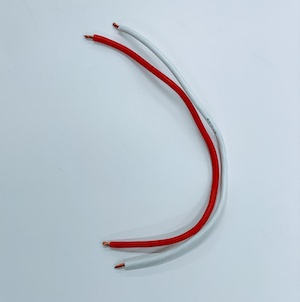
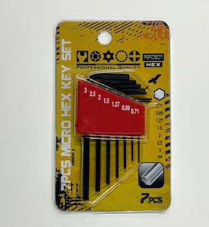

# BOM

## 3D Printer(下回り)

|画像|パーツ名|用途|必要個数|製作者|
|:--|:--|:--|:--|:--|
||[Kaya_Wheel_Hub_Inside_v2.stl](https://github.com/ROBOTIS-JAPAN-GIT/kaya-robot/raw/jp_custom_kaya/cad-files/kaya_jp_v2/Kaya_Wheel_Hub_Inside_v2.stl)|オムニホイール固定用|3ケ|NVIDIA公開データをRobotis Japanで改良|
||[Kaya_Wheel_Hub_Outside_v2.stl](https://github.com/ROBOTIS-JAPAN-GIT/kaya-robot/raw/jp_custom_kaya/cad-files/kaya_jp_v2/Kaya_Wheel_Hub_Outside_v2.stl)|オムニホイール固定用|3ケ|NVIDIA公開データをRobotis Japanで改良|
||[Kaya_Motor_Bottom_Plate_XC430.stl](https://github.com/FaBoPlatform/Kaya/raw/master/stl/Kaya_Motor_Bottom_for_XC430.stl)|サーボモーター固定用|3ケ|NVIDIA公開データをRobotis Japanで改良|
||[Battery_Holder_base](https://github.com/FaBoPlatform/Kaya/raw/master/stl/Battery_Holder_base.stl)|バッテリーフォルダー|1ケ|NVIDIA公開データをRobotis Japanで改良|
||[Battery_Holder_Lid_alone](https://github.com/FaBoPlatform/Kaya/raw/master/stl/Battery_Holder_Lid_alone.stl)|バッテリーフォルダー|1ケ|NVIDIA公開データをRobotis Japanで改良|
||[Kaya_board_holder](https://github.com/FaBoPlatform/Kaya/raw/master/stl/Kaya_board_holder.stl)|ボードフォルダー|1ケ|NVIDIA公開データをRobotis Japanしたものをさらに、FaBoで改良|

## 3D Printer(上回り)

|画像|パーツ名|用途|必要個数|製作者|
|:--|:--|:--|:--|:--|
||[Kaya_pusher.stl](https://github.com/FaBoPlatform/Kaya/raw/master/stl/Kaya_pusher.stl)|フロントのプッシャー|１ケ|NVIDIA公開データをFaBoで改良|
||[Kaya_Realsense_Bridge.stl](https://github.com/FaBoPlatform/Kaya/raw/master/stl/Kaya_Realsense_Bridge.stl)|リアルセンスをマウントする土台|１ケ|NVIDIA公開データをFaBoで改良|
||[Kaya_Realsense_Mount_rev1.stl](https://github.com/FaBoPlatform/Kaya/raw/master/stl/Kaya_Realsense_Mount_rev1.stl)|リアルセンスを固定|１ケ|NVIDIA公開データ|
||[Kaya_body.stl](https://github.com/FaBoPlatform/Kaya/raw/master/stl/Kaya_body.stl)|Jetson Nanoを固定|１ケ|NVIDIA公開データをFaBoで改良|

## カーボン

|画像|パーツ名|用途|必要個数|製作者|
|:--|:--|:--|:--|:--|
||[base_plate.ai](https://github.com/FaBoPlatform/Kaya/raw/master/ai/base_plate.ai)|すべてを固定するベース|1枚|FaBo|

## サーボ

|画像|パーツ名|用途|必要個数|製作者|
|:--|:--|:--|:--|:--|
||[X430-W150](https://e-shop.robotis.co.jp/product.php?id=303)|オムニホイールを回転|3個|Robotis|

## 電装系

|画像|パーツ名|用途|必要個数|製作者|
|:--|:--|:--|:--|:--|
||[U2D2](https://e-shop.robotis.co.jp/product.php?id=190)|Jetson NanoからUSBで制御|１ケ|Robotis|
||[U2D2 PHB Set](https://e-shop.robotis.co.jp/product.php?id=325)|サーボを接続|１ケ|Robotis|
||5V降圧回路|Jetson Nano用の5Vを生成|１ケ|FaBo|
||[ACアダプター 12V 7A (84W) Φ2.5](https://e-shop.robotis.co.jp/product.php?id=331)|LiPoの充電, サーボの電源|１ケ|Robotis|

## バッテリー

|画像|パーツ名|用途|必要個数|製作者|
|:--|:--|:--|:--|:--|
||[LIPO Battery 11.1V 1800mAh LB-012](https://e-shop.robotis.co.jp/product.php?id=169)|すべての動力源|１ケ|Robotis|
||[LIPO Battery Charger LBC-010](https://e-shop.robotis.co.jp/product.php?id=172)|充電器|1ケ|Robotis|

## センサー　

|画像|パーツ名|用途|必要個数|製作者|
|:--|:--|:--|:--|:--|
||[ReaslSense D435](https://www.intelrealsense.com/depth-camera-d435/)|DepthCameraなど|１ケ|Intel|
||[BMI160 Module]()|IMUで使用|1ケ|GY-Module|

## Jetson関連

|画像|パーツ名|用途|必要個数|製作者|
|:--|:--|:--|:--|:--|
||[Jetson Nano 4GB](https://www.nvidia.com/ja-jp/autonomous-machines/embedded-systems/jetson-nano-developer-kit/)|メイン頭脳|１ケ|NVIDIA|
||拡張ボード|I2Cの拡張, BMI160と接続|1ケ|FaBo|
||CPU Fan|Jetson Nano冷却用|1ケ|FaBo|
||CPU Fan JIg|CPU Fan取り付けJig|1ケ|FaBo|
||[WiFi Module(8265)](https://ark.intel.com/content/www/jp/ja/ark/products/94150/intel-dual-band-wireless-ac-8265.html)|WiFiやBluetooth|1式|Intel|
||SD Card(64GB)|JetpackとIsaac SDK|1式|SanDisk|

## ケーブル

|画像|パーツ名|用途|必要個数|製作者|
|:--|:--|:--|:--|:--|
||USB 3.X Cable|Realsense用|１ケ|amazon|
||USB 3.X L時変換|Realsense用|１ケ||
||コネクタ付きケーブル|U2D2 PHB給電用|１ケ|FaBo|
||ケーブル(赤,白)|Jetson Nano給電用|１ケ|FaBo|
||DC-USBケーブル|Jetson Nano給電用|１ケ|FaBo|
||USBデータ通信対応|U2D2とJetsonの通信用ケーブル|１ケ|FaBo|
||結束バンド|ケーブル(赤,白)を固定|1本|FaBo|

## 操作

|画像|パーツ名|用途|必要個数|製作者|
|:--|:--|:--|:--|:--|
||[F710](https://gaming.logicool.co.jp/ja-jp/products/gamepads/f710-wireless-gamepad.html)|Kayaの操作|１ケ|Logicool|

## ネジ等

|画像|パーツ名|用途|必要個数|製作者|
|:--|:--|:--|:--|:--|
||①Wheel固定|Wheelの固定|M3x20 3本, M3ナット(長) 3個|FaBo|
||②Servo固定|Servoの固定|M3x8(皿頭) 12本, M3ナット 12個|FaBo|
||③バッテリー・基板固定|バッテリーや基板の固定|M3x8 イモネジ 16本|FaBo|
||④上下接続|上下の接続|M3x8六角ネジ 1本, M3x12六角ネジ 2本, M3ナット(弛み止め) 3個|FaBo|
||⑤Jetson固定ネジ|Jetsonの固定用|M2x5六角スクリュ 4本|FaBo|
||⑥CPU Fan固定ネジ|CPU Fanの固定用|M2.5x16 4本, M2.5ナット 4個|FaBo|
||⑦Realsens固定|Ralsense固定用|M3x8六角 9本, M3ナット 7個|FaBo|

## 工具

|画像|パーツ名|用途|必要個数|製作者|
|:--|:--|:--|:--|:--|
||+1x75ドライバー|１ケ|ANEX|
||+2x100ドライバー|１ケ|モノタロウ|
||精密ドライバーセット|１ケ||
||ドライバーナットタイプ|１ケ||
||スパナ|１ケ||
||六角レンチ|１式||

