# Dynamixelの設定

Dynamixel Wizardを使って、サーボのIDを設定します(必須)。

## 必要なハードウェア

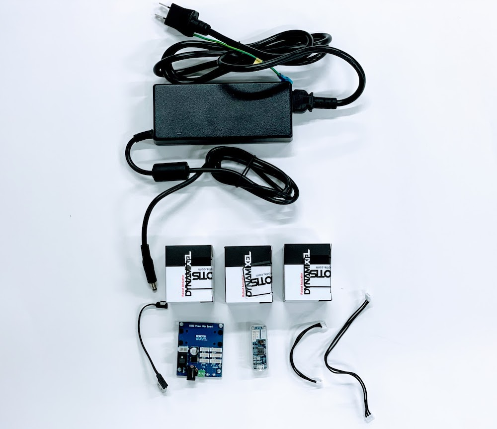

|パーツ名|用途|必要個数|
|:--|:--|:--|
|ACアダプター 12V 7A (84W) Φ2.5|サーボ動作電源|1個|
|X430-W150|サーボ|3個|
|Dynamixel 3線ケーブル(短)|U2D2とU2D2 PHB Set接続|1本|
|Dynamixel 3線ケーブル(長)|U2D2 PHB Setとサーボ接続|1本|
|U2D2|PCと接続|1個|
|U2D2 PHB Set|サーボと接続|1個|

## 配線

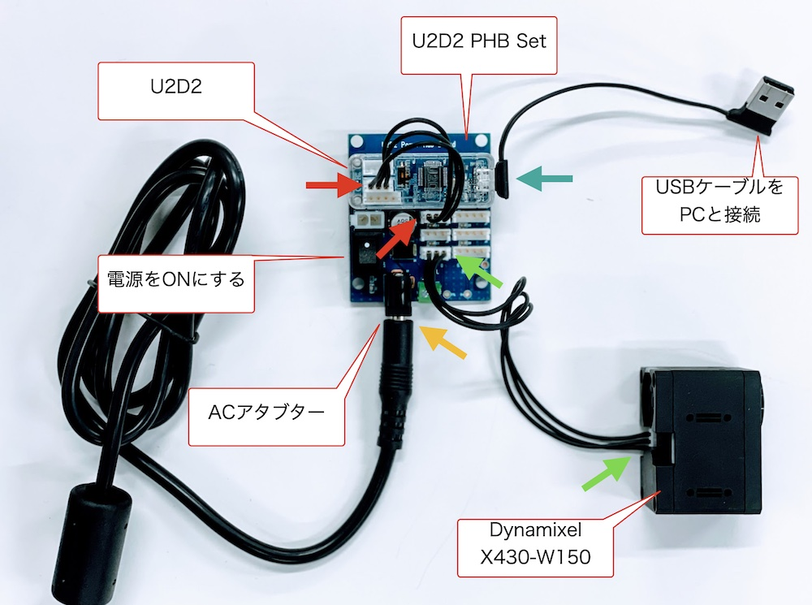

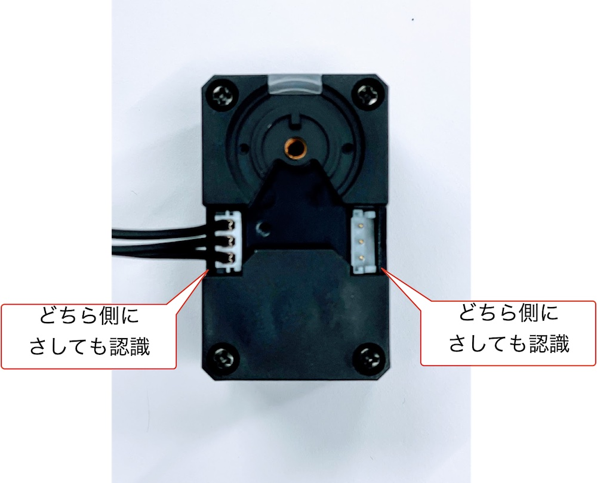

## Dynamixel Wizard

Dynamixel Wizardは、Robotis社のDynamixelのID管理や操作が可能なツールです。Windows, Linux, Mac版があります。

[https://emanual.robotis.com/docs/en/software/dynamixel/dynamixel_wizard2/](https://emanual.robotis.com/docs/en/software/dynamixel/dynamixel_wizard2/)

より、Dynamixel Wizard 2.0をダウンロードし、インストールします。

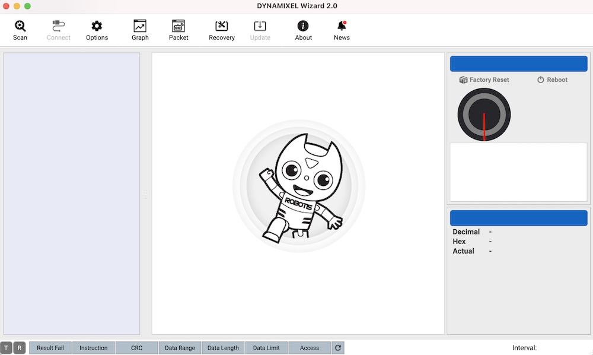

## IDを設定する

U2D2とU2D2 Power Hub Boardを接続し、DCコネクターを接続し、電源をOnにします。
この状態で、U2D2とPCを接続し、Dynamixel Wizard 2.0を起動します。

Scanには、時間がかかるので、検索対象をOptionで絞り込みます。

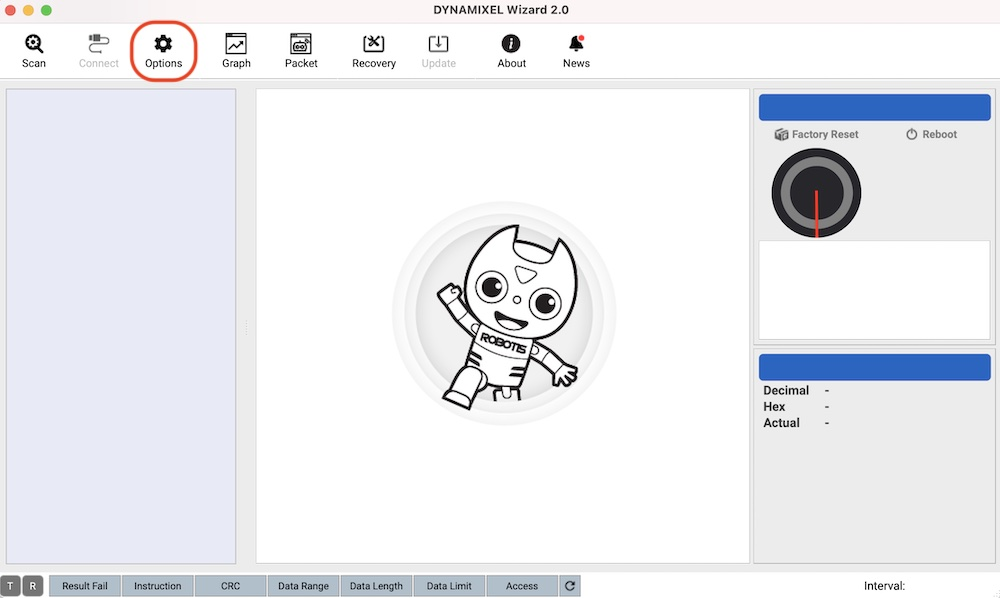

IDを設定したいサーボを接続し、Scanします。IDに重複があるとScanに失敗するので、設定では1つのサーボのみ接続します。

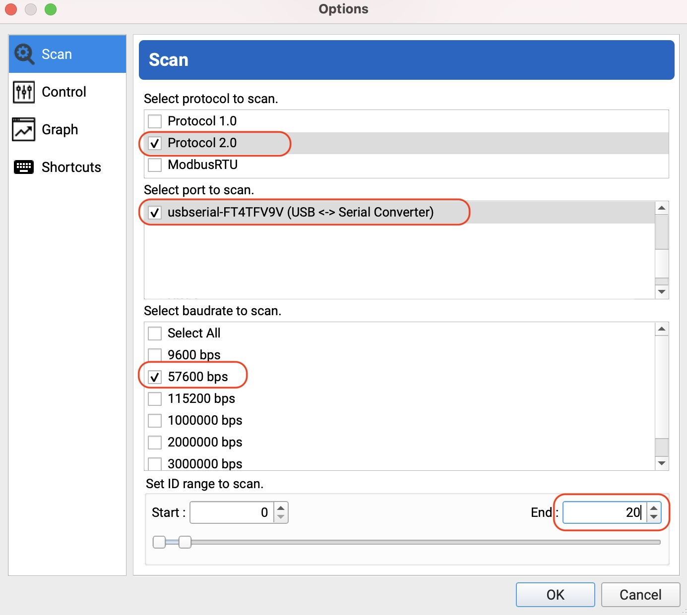

## サーボ ID

サーボのIDを設定します。今回は3つのサーボをID:1, ID:2, ID:3に設定します。

|サーボ|サーボID|
|:--|:--|
|1つ目のサーボ|1|
|2つ目のサーボ|2|
|3つ目のサーボ|3|

## 1つ目のサーボ

U2D2 Power Hub Boardに、サーボを1つだけ接続し、Scanします。

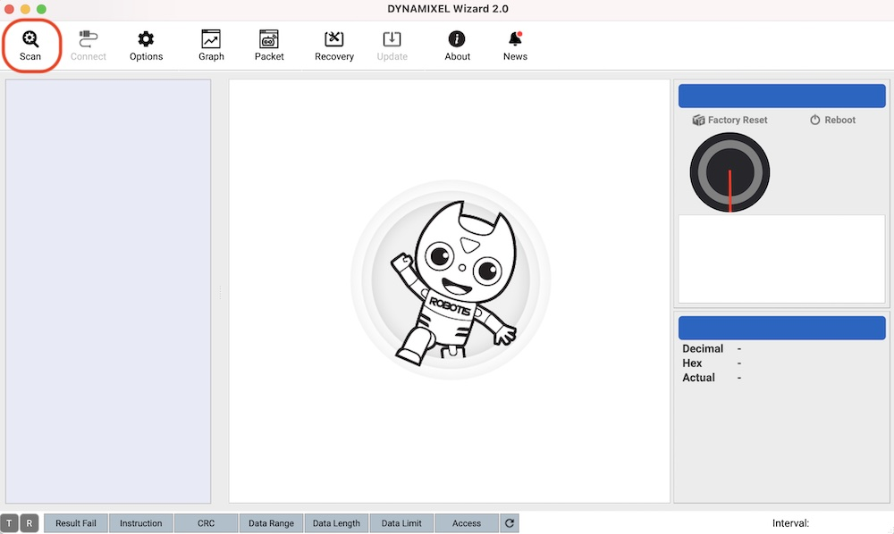

サーボが発見されます。

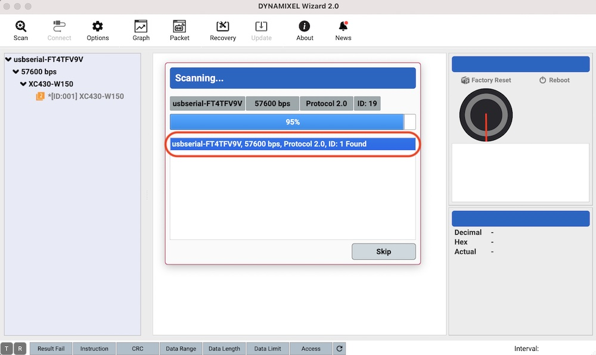

1つ目は、初期値のままの1で大丈夫です。
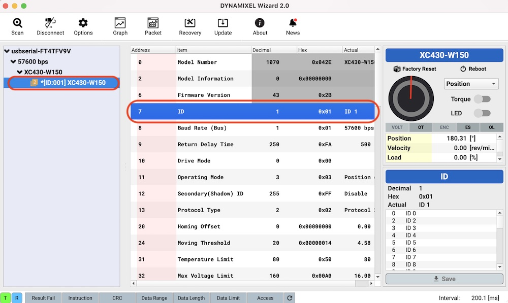

サーボIDをサーボに付箋等を貼り付けて、IDが組み立て時にわかるようにしておきます。

## 2つ目のサーボ

U2D2 Power Hub Boardに、サーボを1つだけ接続し、Scanします。

サーボが発見されます。

2つ目は、IDを2に変更します。

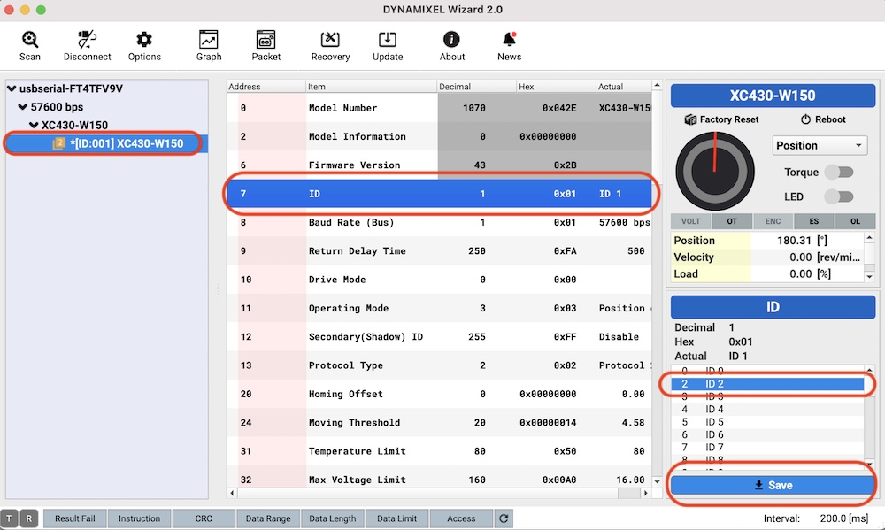

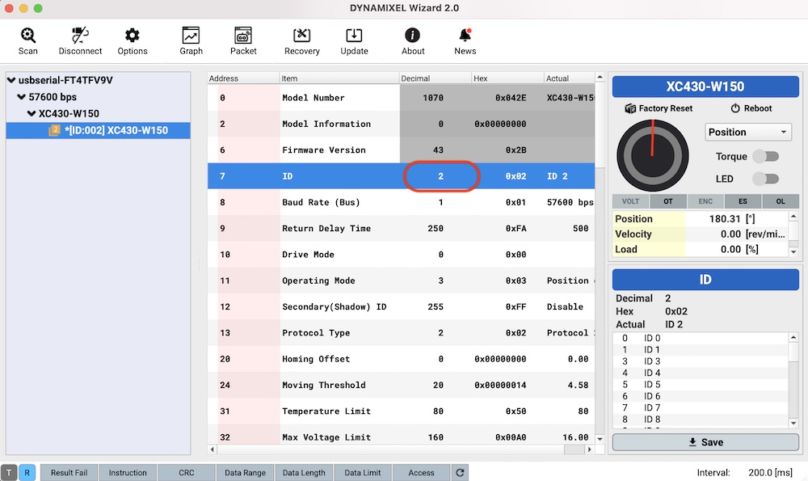

サーボIDをサーボに付箋等を貼り付けて、IDが組み立て時にわかるようにしておきます。

## 3つ目のサーボ

U2D2 Power Hub Boardに、サーボを1つだけ接続し、Scanします。

サーボが発見されます。

3つ目は、IDを3に変更します。

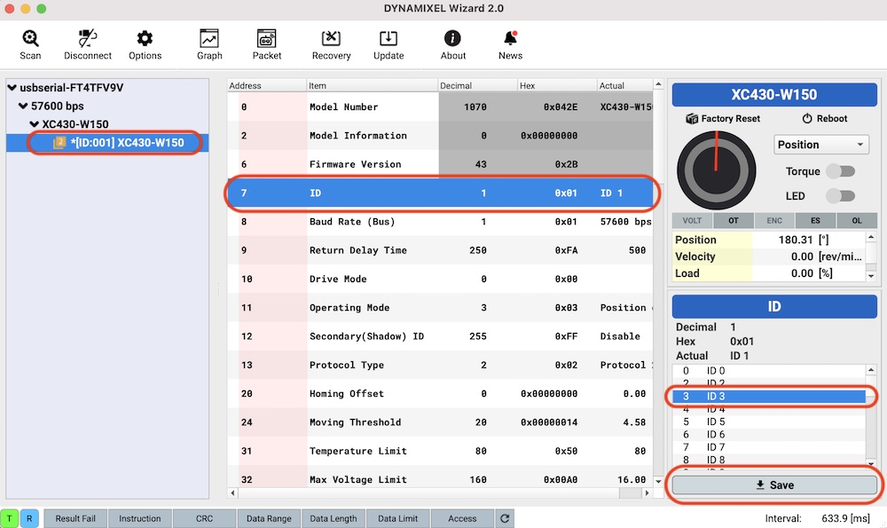

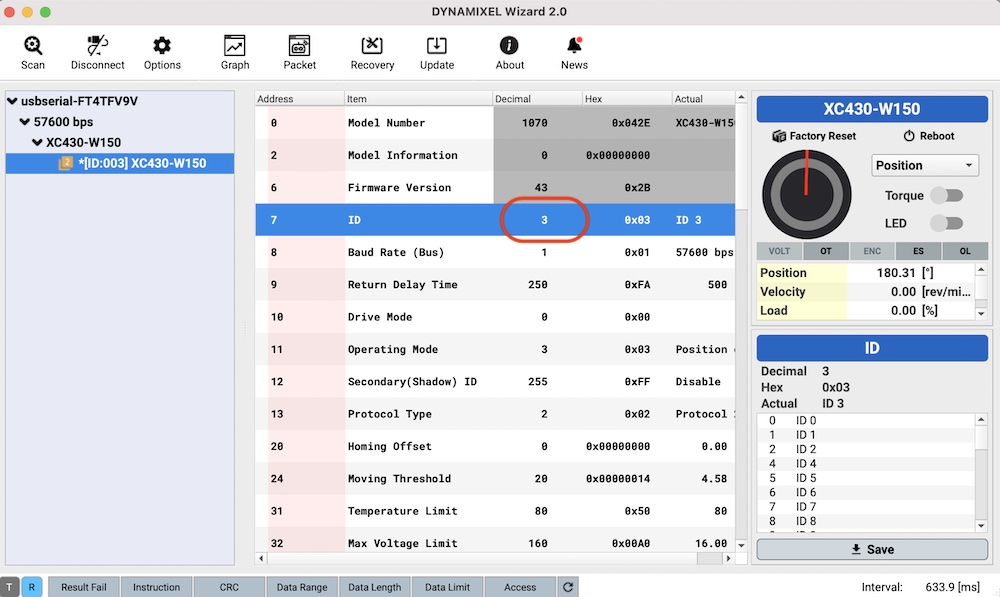

サーボIDをサーボに付箋等を貼り付けて、IDが組み立て時にわかるようにしておきます。

