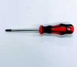
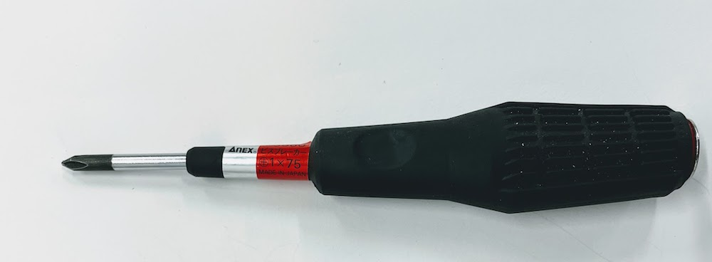

# 組み立て(下部足周り)

## 必要なパーツと工具

|画像|パーツ名|個数|
|:--|:--|:--|
||[X430-W150](https://e-shop.robotis.co.jp/product.php?id=303)|3個|
||[Kaya_Wheel_Hub_Inside_v2.stl](https://github.com/ROBOTIS-JAPAN-GIT/kaya-robot/raw/jp_custom_kaya/cad-files/kaya_jp_v2/Kaya_Wheel_Hub_Inside_v2.stl)|3ケ|
||[Kaya_Wheel_Hub_Outside_v2.stl](https://github.com/ROBOTIS-JAPAN-GIT/kaya-robot/raw/jp_custom_kaya/cad-files/kaya_jp_v2/Kaya_Wheel_Hub_Outside_v2.stl)|3ケ|
||[Kaya_Motor_Bottom_Plate_XC430.stl](https://github.com/FaBoPlatform/Kaya/raw/master/stl/Kaya_Motor_Bottom_for_XC430.stl)|3ケ|
||[base_plate.ai](https://github.com/FaBoPlatform/Kaya/raw/master/ai/base_plate.ai)|1枚|
||①.Wheel固定|1式|
||②.Servo固定|1式|
||+1x75ドライバー|１ケ|
||+2x100ドライバー|１ケ|
||精密ドライバーセット|１ケ|

## サーボの組み立て

M3ナット(長)をはめ込みます。

DYNAMIXELに、はめ込みます。

DYNAMIXELの箱の中のビニール袋から、黒ネジを取り出します。

黒ネジ(小)を4本取り出します。

精密ドライバーをつかって、4つのネジで固定します。

## Mounter

DYNAMIXELの下側のネジ4つを1x75ドライバーをつかって取り外します。

取り外したネジ4本で、Mounterに再び固定します。

## カーボンに固定

この作業から、ドライバーを2x100に変更します。

## オムニホイールを固定

## サーボの配置と配線

