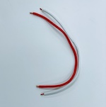
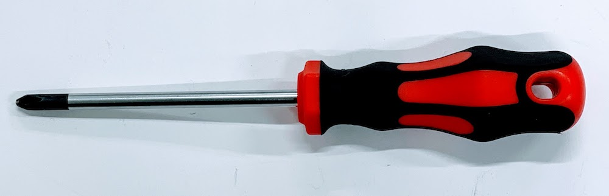
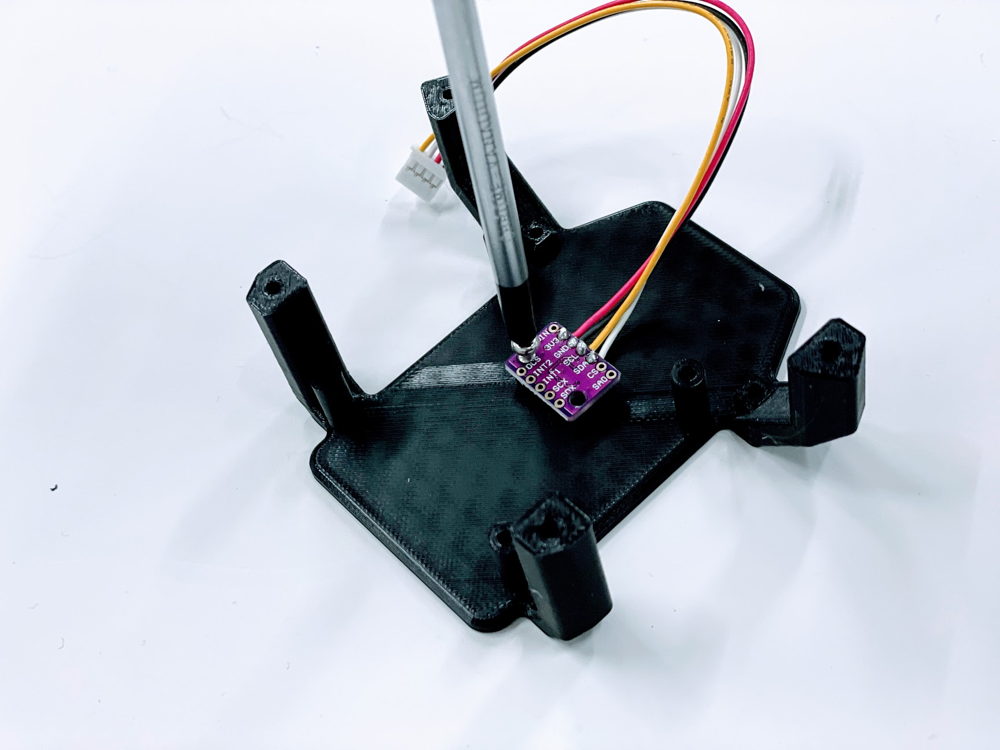
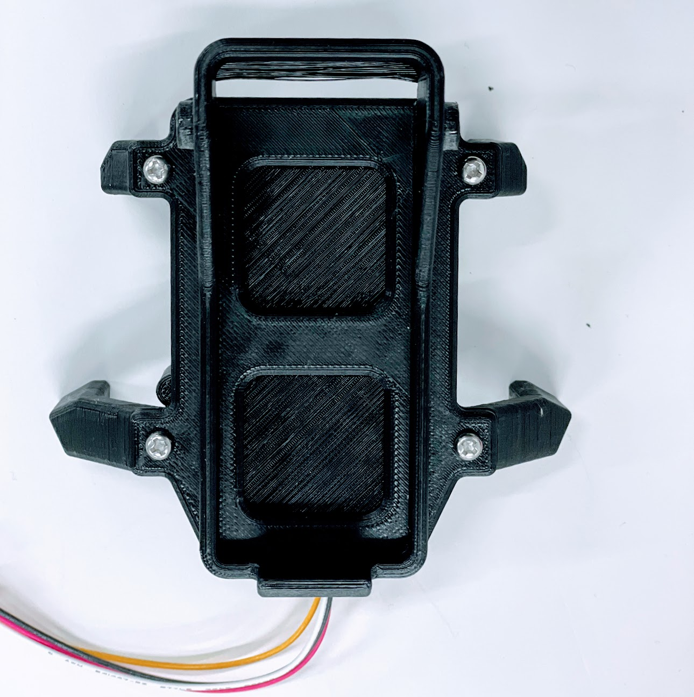
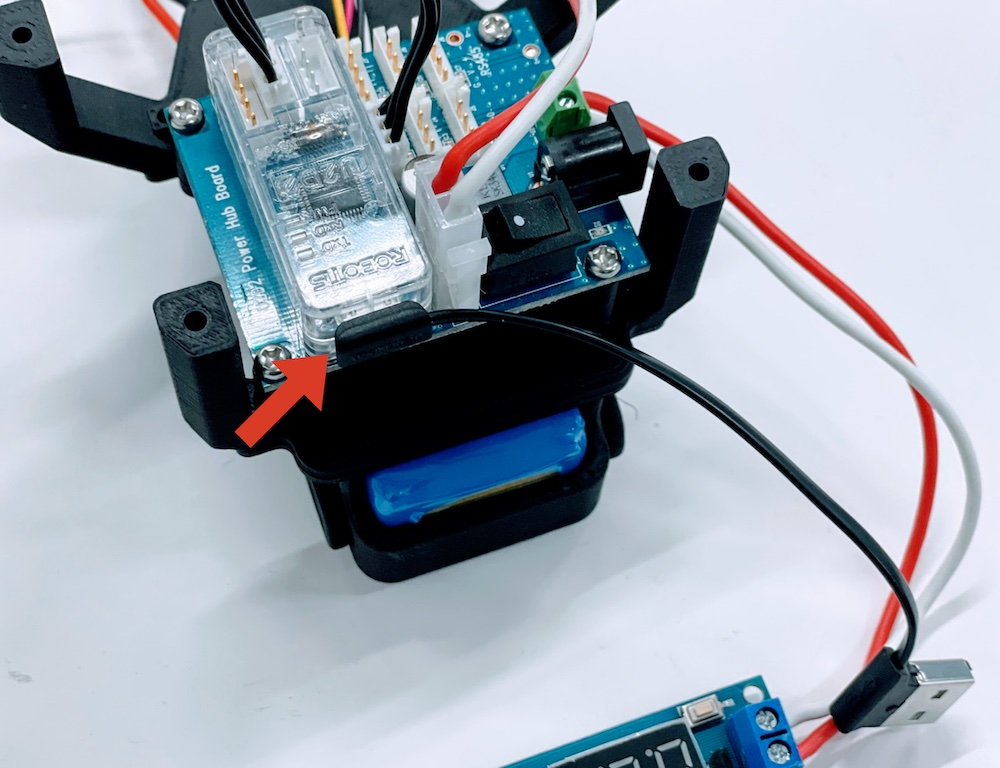

# 組み立て(下部電装)

## 必要なパーツと工具

|画像|パーツ名|個数|
|:--|:--|:--|
||Battery_Holder_base|1ケ|
||Battery_Holder_Lid_alone|バッテリーフォルダー|1ケ|
||Kaya_board_holder|1ケ|
||U2D2|１ケ|
||U2D2 PHB Set|１ケ|
||5V降圧回路|１ケ|
||U2D2 PHB給電用|１ケ|
||ケーブル(赤,白)１ケ|
||USBデータ通信対応|１ケ|
||BMI160 Module|1ケ|
||③.バッテリー・基板固定|1式|
||+2x100ドライバー|１ケ|
||精密ドライバーセット|１ケ|

## IMUの取り付け

この作業は、ドライバーを2x100を使用します。

IMUとしてBMI160を取り付けます。

## バッテリーフォルダ

バッテリーフォルダーをネジで結合します。

## U2D2 PHBの装着

U2D2 PHBの袋の入っている黒いプラスチック固定具を4つ用意します。

U2D2 PHBに取り付けます。

U2D2 PHBをネジで固定します。

## バッテリーの取り付け

## ケーブルの装着

ケーブルを装着します。

## 降圧回路の接続

精密ドライバーをつかって、降圧回路基板とU2D2 PHBを接続します。

## U2D2の装着

U2D2をU2D2 PHBに装着し、ケーブル(3線)を接続します。

USBケーブルをさしておきます。

## 接続

BMI160に接続しているケーブル、電源と降圧回路基板を接続しているケーブル、降圧回路基板、USBケーブルは上にでるようにします。

4個所をネジで固定します。

