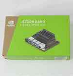
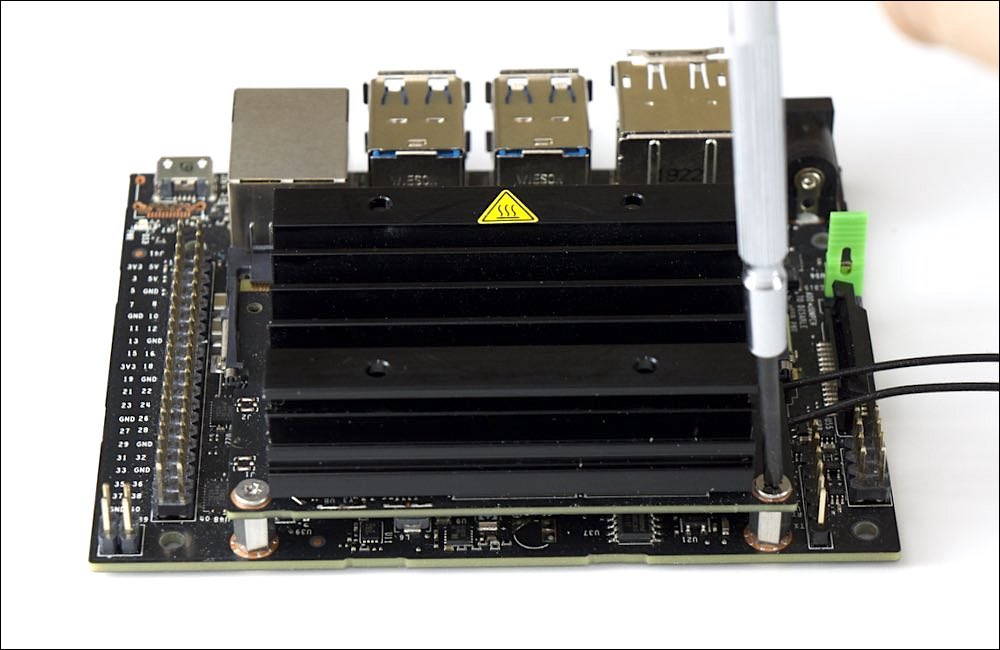

# 組み立て(Jetson)

|画像|パーツ名|個数|
|:--|:--|:--|
||Jetson Nano 4GB|１ケ|
||WiFi Module(8265|1式|
||拡張ボード|1ケ|
||CPU Fan|1ケ|
||⑤.Jetson固定ネジ|1式|
||+1x75ドライバー|１ケ|
||精密ドライバーセット|１ケ|

## アンテナの設置

## Jetsonの固定

## Jumper Pin

JumperPinをショートさせる事で、DCジャックから電源供給が可能になります。

## CPU Fanの取り付け

## I2C用拡張ボードの取り付け　

