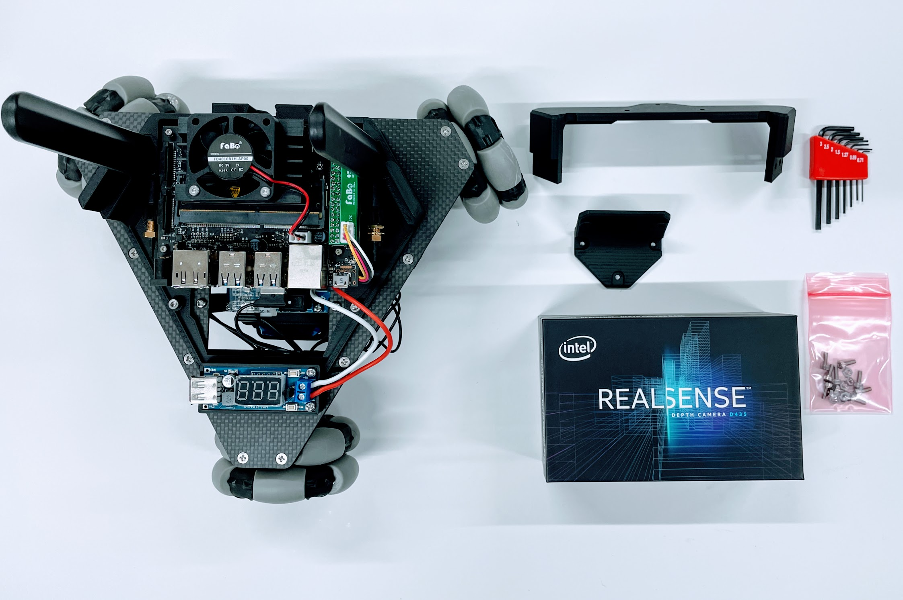
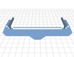
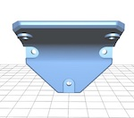
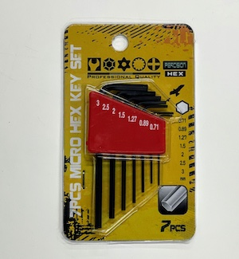
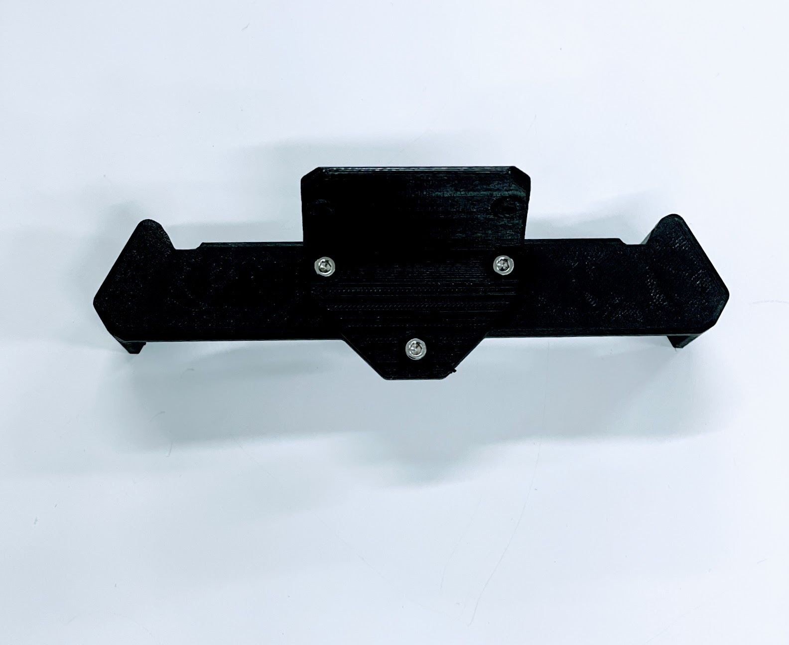
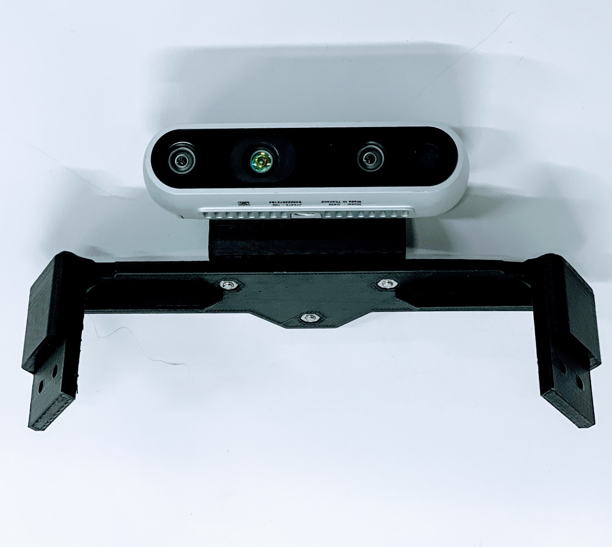

# 組み立て(Realsense)

|画像|パーツ名|個数|
|:--|:--|:--|
||Kaya_Realsense_Bridge.stl|１ケ|
||Kaya_Realsense_Mount_rev1.stl|１ケ|
||ReaslSense D435|１ケ|
||六角レンチ|1式|
||⑦Realsens固定|M3x8六角 9本, M3ナット 7個|

## RealSenseの組み立て

