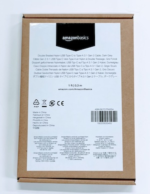
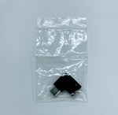
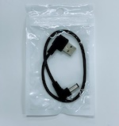
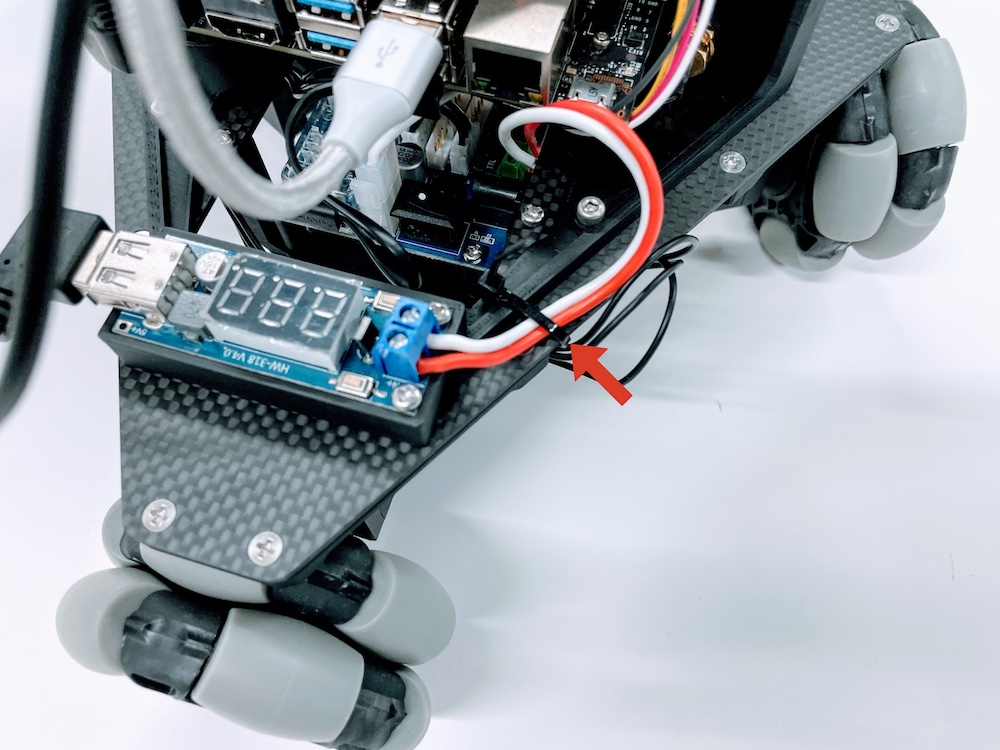

# 組み立て(配線等)

|画像|パーツ名|個数|
|:--|:--|:--|
||USB 3.X Cable|１ケ|
||USB 3.X L時変換|１ケ|
||DC-USBケーブル|１ケ|
||六角レンチ|1式|

## RealSenseの配線

## RealSenseの固定

## RealSenseの配線

## DC-USBケーブルの配線

## 結束バンドでケーブルを固定

