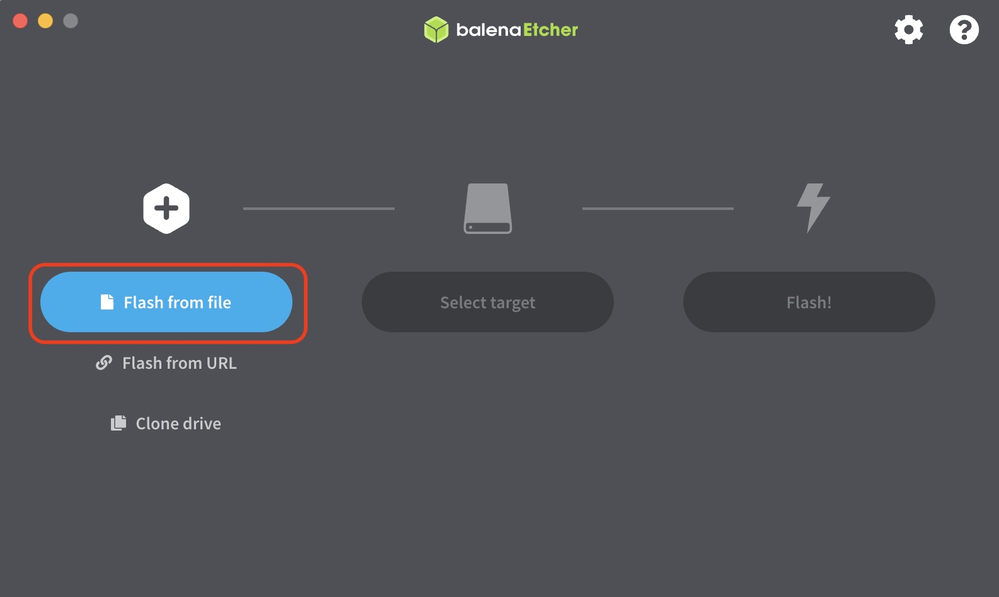
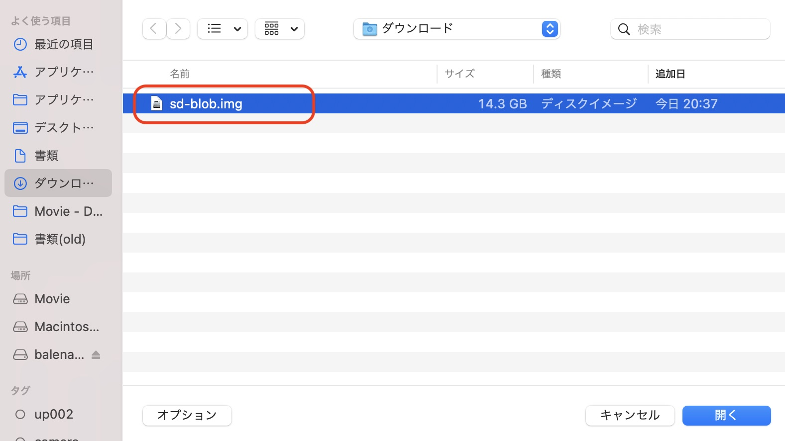
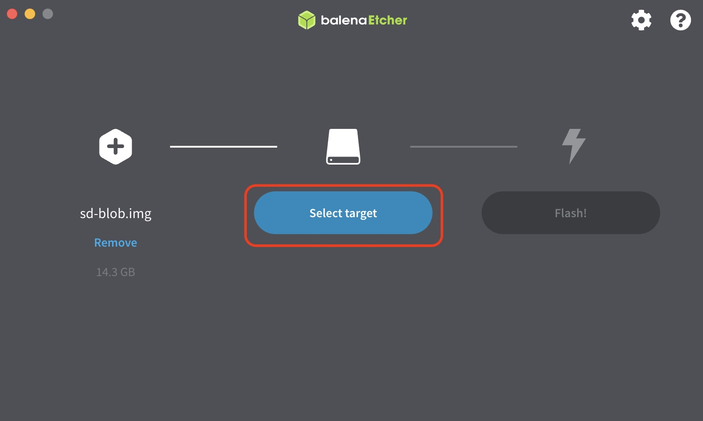

# Jetson Nano 4GBの設定

## 対応JetPack

Kayaに対応しているJetPackのVersionは、4.4.1以降になります。

## JetPack SDK 4.4.1のダウンロード

[https://developer.nvidia.com/jetpack-sdk-441-archive](https://developer.nvidia.com/jetpack-sdk-441-archive) からJetson Nano 4GB用のJetpack 4.4.1のイメージをダウンロードします。

## SDカードの焼き込みツール
SDカードの焼き込みにはEtcherを使用します。 [https://www.balena.io/etcher/](https://www.balena.io/etcher/)

## イメージのSDカードへの焼き込み

