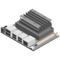

# Ping_Python

## Build(PC)


```console
cd ~/isaac/sdk
bazel build //apps/tutorials/ping_python
```

## Deploy(PC)


```console
cd ~/isaac/sdk
./../engine/engine/build/deploy.sh --remote_user jetson -p //apps/tutorials/ping_python:ping_python-pkg -d jetpack44 -h JetsonのIPアドレス
```

## RUN(Jetson)



```console
sudo pip3 install pkgconf, Cython, pycapnp, numpy-quaternion
```

```console
cd /home/jetson/deploy/jetson/ping_python-pkg
./run apps/tutorials/ping_python/ping_python.py
```

## Source(PC)


BUILD
```c
"""
Copyright (c) 2019, NVIDIA CORPORATION. All rights reserved.

NVIDIA CORPORATION and its licensors retain all intellectual property
and proprietary rights in and to this software, related documentation
and any modifications thereto. Any use, reproduction, disclosure or
distribution of this software and related documentation without an express
license agreement from NVIDIA CORPORATION is strictly prohibited.
"""

load("//bzl:module.bzl", "isaac_pkg")

py_binary(
    name = "ping_python",
    srcs = [
        "__init__.py",
        "ping_python.py",
    ],
    data = [
        "ping_python.app.json",
        "//apps:py_init",
        "//apps/tutorials:py_init",
        "//packages/sight:libsight_module.so",
    ],
    deps = [
        "//packages/pyalice",
    ],
)

isaac_pkg(
    name = "ping_python-pkg",
    srcs = ["ping_python"],
)
```

__init__.py
```python
'''
Copyright (c) 2019, NVIDIA CORPORATION. All rights reserved.

NVIDIA CORPORATION and its licensors retain all intellectual property
and proprietary rights in and to this software, related documentation
and any modifications thereto. Any use, reproduction, disclosure or
distribution of this software and related documentation without an express
license agreement from NVIDIA CORPORATION is strictly prohibited.
'''
```

ping_python.app.json
```python
{
  "name": "ping_python",
  "modules":["sight"],
  "graph": {
    "nodes": [
      {
        "name": "ping_node",
        "components": []
      }
    ],
    "edges": []
  },
  "config": {
    "ping_node": {
      "PyCodelet": {
        "message": "Hello Word!"
      }
    }
  }
}
```

ping_python.py
```python
'''
Copyright (c) 2019, NVIDIA CORPORATION. All rights reserved.

NVIDIA CORPORATION and its licensors retain all intellectual property
and proprietary rights in and to this software, related documentation
and any modifications thereto. Any use, reproduction, disclosure or
distribution of this software and related documentation without an express
license agreement from NVIDIA CORPORATION is strictly prohibited.
'''

from isaac import *

# A Python codelet for proportional control
# For comparison, please see the same logic in C++ at "PingCpp.cpp".
#
# We receive odometry information, from which we extract the x position. Then, using refence and
# gain parameters that are provided by the user, we compute and publish a linear speed command
# using `control = gain * (reference - position)`
class PingPython(Codelet):
    def start(self):
        # This part will be run once in the beginning of the program
        # We can tick periodically, on every message, or blocking. See documentation for details.
        self.tick_periodically(1.0)

    def tick(self):
        # This part will be run at every tick. We are ticking periodically in th is example.
        # Print out message to console. The message is set in ping_python.app.js on file.
        print(self.config.message)

def main():
    app = Application(app_filename="apps/tutorials/ping_python/ping_python.app.json")
    app.load_module("sight")
    app.nodes["ping_node"].add(PingPython)
    app.run()

if __name__ == '__main__':
    main()
```