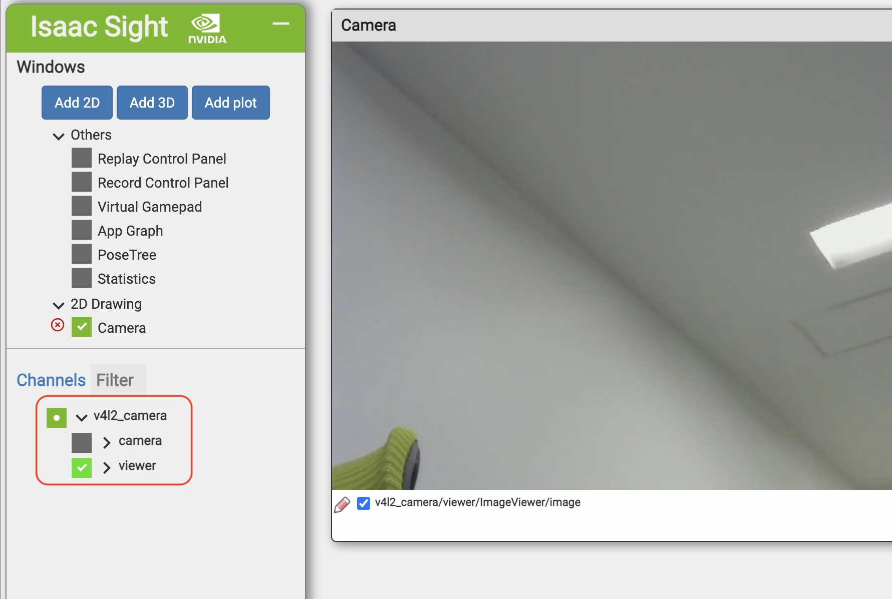

# v4l2_camera

## Build(PC)


```console
cd ~/isaac/sdk
bazel build //apps/samples/v4l2_camera
```

## Deploy(PC)


```console
cd ~/isaac/sdk
./../engine/engine/build/deploy.sh --remote_user Jetsonのユーザ名 -p //apps/samples/v4l2_camera:v4l2_camera-pkg -d jetpack44 -h JetsonのIPアドレス
```

## RUN(Jetson)


```console
cd /home/jetson/deploy/jetson/v4l2_camera-pkg
apps/samples/v4l2_camera/v4l2_camera
```

## 接続(PC)


`http://jetsonのipアドレス:3000`

## 操作(PC)





## Source(PC)

BUILD
```c 
"""
Copyright (c) 2019, NVIDIA CORPORATION. All rights reserved.

NVIDIA CORPORATION and its licensors retain all intellectual property
and proprietary rights in and to this software, related documentation
and any modifications thereto. Any use, reproduction, disclosure or
distribution of this software and related documentation without an express
license agreement from NVIDIA CORPORATION is strictly prohibited.
"""

load("//bzl:module.bzl", "isaac_app")

isaac_app(
    name = "v4l2_camera",
    modules = [
        "sensors:v4l2_camera",
        "sight",
        "viewers",
    ],
)
```


```json
{
  "name": "v4l2_camera",
  "modules": [
    "sensors:v4l2_camera",
    "sight",
    "viewers"
  ],
  "graph": {
    "nodes": [
      {
        "name": "camera",
        "components": [
          {
            "name": "MessageLedger",
            "type": "isaac::alice::MessageLedger"
          },
          {
            "name": "V4L2Camera",
            "type": "isaac::V4L2Camera"
          }
        ]
      },
      {
        "name": "viewer",
        "components": [
          {
            "name": "MessageLedger",
            "type": "isaac::alice::MessageLedger"
          },
          {
            "name": "ImageViewer",
            "type": "isaac::viewers::ImageViewer"
          }
        ]
      }
    ],
    "edges": [
      {
        "source": "camera/V4L2Camera/frame",
        "target": "viewer/ImageViewer/image"
      }
    ]
  },
  "config": {
    "camera": {
      "V4L2Camera": {
        "device_id": 0,
        "rows": 448,
        "cols": 800,
        "rate_hz": 20
      }
    },
    "websight": {
      "WebsightServer": {
        "port": 3000,
        "ui_config": {
          "windows": {
            "Camera": {
              "renderer": "2d",
              "channels": [
                { "name": "v4l2_camera/viewer/ImageViewer/image" }
              ]
            }
          }
        }
      }
    }
  }
}
```