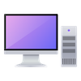

# imu_caliburation

## Build(PC)



```console
cd ~/isaac/sdk
bazel build //apps/samples/imu
```

## Deploy(PC)


```console
cd ~/isaac/sdk
./../engine/engine/build/deploy.sh --remote_user Jetsonのユーザ名 -p //apps/samples/imu:imu-pkg -d jetpack44 -h JetsonのIPアドレス
```

## RUN(Jetson)


```console
cd /home/jetson/deploy/jetson/imu-pkg
apps/samples/imu/imu
```

## 接続(PC)


`http://jetsonのipアドレス:3000`

## 操作(Jetson)

`deploy/jetson/imu_calibration-pkg/apps/samples/imu_calibration/imu_calibration.out.json`にキャリブレーションの値が出力される。

## Source(PC)

BUILD
```c 
"""
Copyright (c) 2019, NVIDIA CORPORATION. All rights reserved.

NVIDIA CORPORATION and its licensors retain all intellectual property
and proprietary rights in and to this software, related documentation
and any modifications thereto. Any use, reproduction, disclosure or
distribution of this software and related documentation without an express
license agreement from NVIDIA CORPORATION is strictly prohibited.
"""

load("//bzl:module.bzl", "isaac_app")

isaac_app(
    name = "imu",
    app_json_file = "imu.app.json",
    modules = [
        "imu",
        "sight",
    ],
)
```

OWNER
```json
inherited: true
owners:
- Cenk Oguz Saglam

```


```json
{
  "name": "imu",
  "modules": [
    "imu",
    "sight"
  ],
  "config": {
    "imu": {
      "iio_bmi160": {
        "i2c_device_id": 1,
        "tick_period": "100Hz"
      }
    },
    "websight": {
      "WebsightServer": {
        "port": 3000,
        "ui_config": {
          "windows": {
            "imu - CorrectedAngularVelocity": {
              "renderer": "plot",
              "dims": {
                "width": 600,
                "height": 600
              },
              "channels": [
                {
                  "name": "imu/imu/imu_corrector/CorrectedAngularVelocity.x"
                },
                {
                  "name": "imu/imu/imu_corrector/CorrectedAngularVelocity.y"
                },
                {
                  "name": "imu/imu/imu_corrector/CorrectedAngularVelocity.z"
                }
              ]
            },
            "imu - CorrectedLinearAcceleration": {
              "renderer": "plot",
              "dims": {
                "width": 600,
                "height": 600
              },
              "channels": [
                {
                  "name": "imu/imu/imu_corrector/CorrectedLinearAcceleration.x"
                },
                {
                  "name": "imu/imu/imu_corrector/CorrectedLinearAcceleration.y"
                },
                {
                  "name": "imu/imu/imu_corrector/CorrectedLinearAcceleration.z"
                }
              ]
            },
            "imu - RawAngularVelocity": {
              "renderer": "plot",
              "dims": {
                "width": 600,
                "height": 600
            },
              "channels": [
                {
                  "name": "imu/imu/imu_corrector/RawAngularVelocity.x"
                },
                {
                  "name": "imu/imu/imu_corrector/RawAngularVelocity.y"
                },
                {
                  "name": "imu/imu/imu_corrector/RawAngularVelocity.z"
                }
              ]
            },
            "imu - RawLinearAcceleration": {
              "renderer": "plot",
              "dims": {
                "width": 600,
                "height": 600
              },
              "channels": [
                {
                  "name": "imu/imu/imu_corrector/RawLinearAcceleration.x"
                },
                {
                  "name": "imu/imu/imu_corrector/RawLinearAcceleration.y"
                },
                {
                  "name": "imu/imu/imu_corrector/RawLinearAcceleration.z"
                }
              ]
            },
            "imu - BiasLinearAcceleration": {
              "renderer": "plot",
              "dims": {
                "width": 600,
                "height": 600
              },
              "channels": [
                {
                  "name": "imu/imu/imu_corrector/BiasLinearAcceleration.x"
                },
                {
                  "name": "imu/imu/imu_corrector/BiasLinearAcceleration.y"
                },
                {
                  "name": "imu/imu/imu_corrector/BiasLinearAcceleration.z"
                }
              ]
            },
            "imu - BiasAngularVelocity": {
              "renderer": "plot",
              "dims": {
                "width": 600,
                "height": 600
              },
              "channels": [
                {
                  "name": "imu/imu/imu_corrector/BiasLinearAcceleration.x"
                },
                {
                  "name": "imu/imu/imu_corrector/BiasLinearAcceleration.y"
                },
                {
                  "name": "imu/imu/imu_corrector/BiasLinearAcceleration.z"
                }
              ]
            },
            "imu - BiasAngularVelocity": {
              "renderer": "plot",
              "dims": {
                "width": 600,
                "height": 600
              },
              "channels": [
                {
                  "name": "imu/imu/imu_corrector/BiasAngularVelocity.x"
                },
                {
                  "name": "imu/imu/imu_corrector/BiasAngularVelocity.y"
                },
                {
                  "name": "imu/imu/imu_corrector/BiasAngularVelocity.z"
                }
              ]
            }
          }
        }
      }
    }
  },
  "graph": {
    "nodes": [
      {
        "name": "imu",
        "components": [
          {
            "name": "message_ledger",
            "type": "isaac::alice::MessageLedger"
          },
          {
            "name": "iio_bmi160",
            "type": "isaac::imu::IioBmi160"
          },
          {
            "name": "imu_corrector",
            "type": "isaac::imu::ImuCorrector"
          }
        ]
      }
    ],
    "edges": [
      {
        "source": "imu/iio_bmi160/imu_raw",
        "target": "imu/imu_corrector/raw"
      }
    ]
  }
}
```