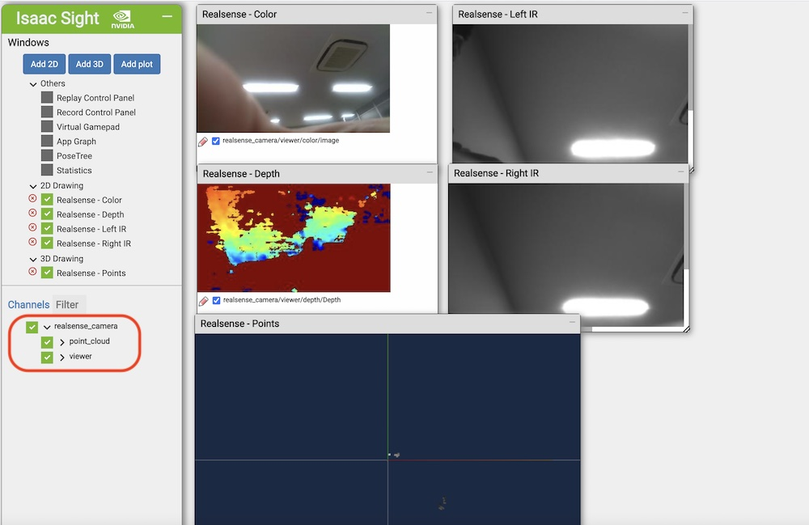

# Realsense

## Build(PC)


```console
cd ~/isaac/sdk
bazel build //apps/samples/realsense_camera
```

## Deploy(PC)


```console
cd ~/isaac/sdk
./../engine/engine/build/deploy.sh --remote_user Jetsonのユーザ名 -p //apps/samples/realsense_camera:realsense_camera-pkg -d jetpack44 -h JetsonのIPアドレス
```

## RUN(Jetson)


```console
cd /home/jetson/deploy/jetson/realsense_camera-pkg
apps/samples/realsense_camera/realsense_camera
```

## 接続(PC)


`http://jetsonのipアドレス:3000`

## 操作(Jetson)



## Source(PC)

BUILD
```c 
"""
Copyright (c) 2019, NVIDIA CORPORATION. All rights reserved.

NVIDIA CORPORATION and its licensors retain all intellectual property
and proprietary rights in and to this software, related documentation
and any modifications thereto. Any use, reproduction, disclosure or
distribution of this software and related documentation without an express
license agreement from NVIDIA CORPORATION is strictly prohibited.
"""

load("//bzl:module.bzl", "isaac_app")

isaac_app(
    name = "realsense_camera",
    app_json_file = "realsense_camera.app.json",
    modules = [
        "realsense",
        "rgbd_processing",
        "sight",
        "viewers",
    ],
)

isaac_app(
    name = "realsense_multicam",
    app_json_file = "realsense_multicam.app.json",
    modules = [
        "realsense",
        "rgbd_processing",
        "sight",
        "viewers",
    ],
)
```


realsense_camera.app.jspn
```json
{
  "name": "realsense_camera",
  "modules": [
    "realsense",
    "rgbd_processing",
    "sight",
    "viewers"
  ],
  "config": {
    "camera": {
      "realsense": {
        "rows": 360,
        "cols": 640,
        "depth_framerate": 15,
        "ir_framerate": 15,
        "rgb_framerate": 30,
        "enable_depth": true,
        "enable_ir_stereo": true,
        "enable_rgb": true,
        "enable_depth_laser": false,
        "align_to_color": false,
        "frame_queue_size": 2,
        "auto_exposure_priority": false
      }
    },
    "viewer": {
      "color": {
        "reduce_scale": 2
      },
      "depth": {
        "reduce_scale": 2,
        "min_visualization_depth": 0.2,
        "max_visualization_depth": 5.0,
        "camera_name": "Realsense",
        "colormap": [
          [128,   0,   0],
          [255,   0,   0],
          [255, 255,   0],
          [0,   255, 255],
          [0,     0, 255],
          [0,     0, 128]
        ]
      }
    },
    "point_cloud": {
      "depth_to_pointcloud": {
        "use_color": true
      }
    },
    "websight": {
      "WebsightServer": {
        "port": 3000,
        "ui_config": {
          "windows": {
            "Realsense - Left IR": {
              "renderer": "2d",
              "dims": {
                "width": 640,
                "height": 360
                              },
              "channels": [
                {
                  "name": "realsense_camera/viewer/left_ir/image"
                }
              ]
            },
            "Realsense - Right IR": {
              "renderer": "2d",
              "dims": {
                "width": 640,
                "height": 360
              },
              "channels": [
                {
                  "name": "realsense_camera/viewer/right_ir/image"
                }
              ]
            },
            "Realsense - Color": {
              "renderer": "2d",
              "dims": {
                "width": 640,
                "height": 360
              },
              "channels": [
                {
                  "name": "realsense_camera/viewer/color/image"
                }
              ]
            },
            "Realsense - Depth": {
              "renderer": "2d",
              "dims": {
                "width": 640,
                "height": 360
              },
              "channels": [
                {
                  "name": "realsense_camera/viewer/depth/Depth"
                }
              ]
            },
            "Realsense - Points": {
              "renderer": "3d",
              "dims": {
                "width": 640,
                "height": 480
              },
              "channels": [
                {
                  "name": "realsense_camera/point_cloud/viewer/points"
                }
              ]
            }
          },
          "assets": {}
        }
      }
 }
  },
  "graph": {
    "nodes": [
      {
        "name": "camera",
        "components": [
          {
            "name": "message_ledger",
            "type": "isaac::alice::MessageLedger"
          },
          {
            "name": "realsense",
            "type": "isaac::RealsenseCamera"
          }
        ]
      },
      {
        "name": "viewer",
        "components": [
          {
            "name": "message_ledger",
            "type": "isaac::alice::MessageLedger"
          },
          {
            "name": "depth",
            "type": "isaac::viewers::DepthCameraViewer"
          },
          {
            "name": "color",
            "type": "isaac::viewers::ImageViewer"
          },
          {
            "name": "left_ir",
            "type": "isaac::viewers::ImageViewer"
          },
          {
            "name": "right_ir",
            "type": "isaac::viewers::ImageViewer"
          }
        ]
      },
      {
        "name": "point_cloud",
        "components": [
          {
            "name": "message_ledger",
            "type": "isaac::alice::MessageLedger"
          },
          {
            "name": "depth_to_pointcloud",
            "type": "isaac::rgbd_processing::DepthImageToPointCloud"
          },
          {
            "name": "viewer",
            "type": "isaac::viewers::PointCloudViewer"
          }
        ]
      }
    ],
    "edges": [
      {
        "source": "camera/realsense/depth",
        "target": "viewer/depth/depth"
      },
      {
        "source": "camera/realsense/depth_intrinsics",
        "target": "viewer/depth/intrinsics"
      },
      {
        "source": "camera/realsense/color",
        "target": "viewer/color/image"
      },
      {
        "source": "camera/realsense/left_ir",
        "target": "viewer/left_ir/image"
      },
      {
        "source": "camera/realsense/right_ir",
        "target": "viewer/right_ir/image"
      },
      {
        "source": "camera/realsense/depth",
        "target": "point_cloud/depth_to_pointcloud/depth"
      },
      {
        "source": "camera/realsense/depth_intrinsics",
        "target": "point_cloud/depth_to_pointcloud/intrinsics"
      },
      {
        "source": "camera/realsense/color",
        "target": "point_cloud/depth_to_pointcloud/color"
      },
      {
        "source": "point_cloud/depth_to_pointcloud/cloud",
        "target": "point_cloud/viewer/cloud"
      }
    ]
  }
}
```

