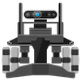
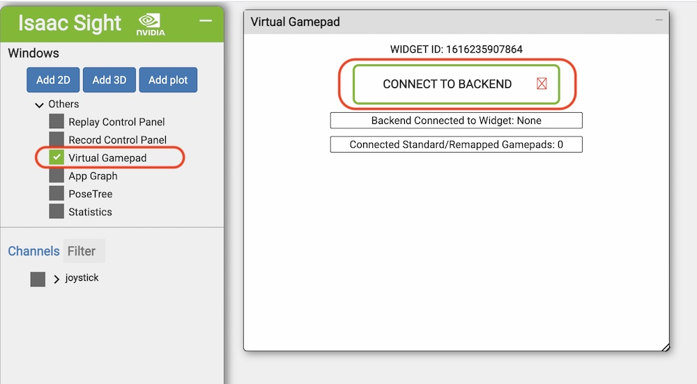
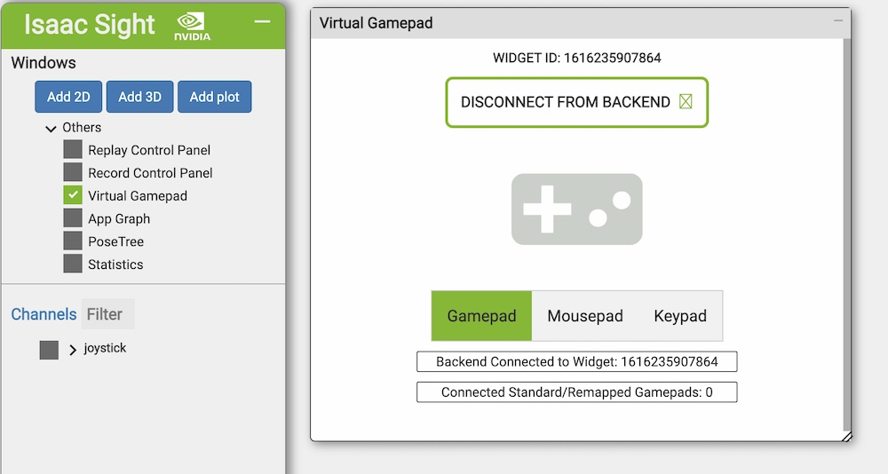
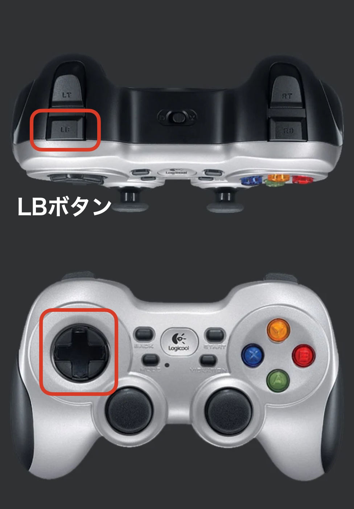

# joystick

## ハードウェアの設定

dunamixelsの項目を修正

|パラメーター|値|
|:--|:--|
|port|/dev/ttyUSB0|
|servo_model|XC430|
|baudrate|k57600|


~/isaac/sdk/apps/kaya/kaya_hardware.subgraph.json
```json
  "dynamixels": {
      "driver": {
        "tick_period": "50 Hz",
        "port": "/dev/ttyUSB0",
        "servo_model": "XC430",
        "baudrate":"k57600",
        "servo_ids": [3, 1, 2]
      },
      "isaac.alice.Failsafe": {
        "name": "robot_failsafe"
      }
    },
```


## Build(PC)


```console
cd ~/isaac/sdk
bazel build //apps/kaya:joystick
```

## Deploy(PC)


```console
cd ~/isaac/sdk
./../engine/engine/build/deploy.sh --remote_user Jetsonのユーザ名 -p //apps/kaya:joystick-pkg -d jetpack44 -h JetsonのIPアドレス
```

## RUN(Kaya)



USBで接続しているDynamixelのU2D2にアクセスするには、rootの権限が必要となるので、`sudo`をつけてコマンドを実行する。

```console
cd /home/jetson/deploy/jetson/joystick-pkg
sudo apps/kaya/joystick
```

## 接続(PC)


`http://jetsonのipアドレス:3000`

## Joystickの接続


F710のUSBドングルをKayaに差し込んで、下記操作を実施。





## 操作



LBボタンを押すと車輪が周り始める。その後、十字キーで操作。

## Source(PC)


joystick.app.json
```json
{
  "name": "joystick",
  "modules": [
    "sight"
  ],
  "config": {
    "odometry.odometry": {
      "HolonomicBaseWheelImuOdometry": {
        "use_imu": false
      }
    }
  },
  "graph": {
    "nodes": [
      {
        "name": "odometry",
        "subgraph": "packages/navigation/apps/holonomic_base_imu_odometry.subgraph.json"
      },
      {
        "name": "2d_kaya",
        "subgraph": "apps/kaya/2d_kaya.subgraph.json"
      },
      {
        "name": "commander",
        "subgraph": "packages/navigation/apps/holonomic_base_commander.subgraph.json"
      }
    ],
    "edges": [
      {
        "source": "2d_kaya.subgraph/interface/base_state",
        "target": "odometry.subgraph/interface/state"
      },
      {
        "source": "commander.subgraph/interface/command",
        "target": "2d_kaya.subgraph/interface/base_command"
      }
    ]
  }
}
```